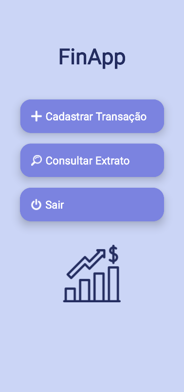
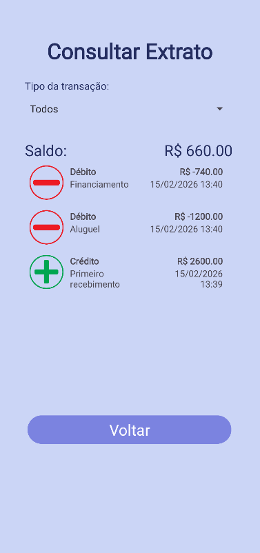

# FinApp — App de Controle Financeiro

**FinApp** é um aplicativo Android, criado como projeto final da disciplina de Desenvolvimento para Dispositivos Móveis. O app permite cadastrar transações financeiras e visualizar o histórico em forma de extrato. O objetivo principal do projeto é aplicar conceitos fundamentais de desenvolvimento mobile na prática.

## ✨ Principais funcionalidades

- **Cadastro de transações** (crédito/débito) com persistência local
- **Lista de transações** usando `RecyclerView` e `Adapter`
- **Visualização de extrato**
- **Armazenamento local** via `DBHelper` (SQLite)
- **Layout responsivo**

## 🛠️ Tecnologias

- Linguagem: **Kotlin**
- Plataforma: **Android (API compatível)**
- Build: **Gradle**
- Persistência: **SQLite**

## 🎯 Conceitos aprendidos

- Ciclo de vida de Activities e navegação com `Intents`
- Uso de `RecyclerView` com `Adapter` para listas performáticas
- Persistência local com **SQLite**
- Sistema de build com **Gradle** e execução no Android Studio

## 📸 Screenshots

## 👥 Autores

- Ana Beatriz Rosa Henrique
- Gabriel Alamartini Troni
- Rhuan Vinicius
